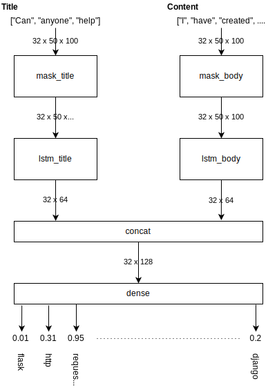

# Stack Overflow Tagging using NLP

This repository contains the code we developed for our project as part of the Applied Deep Learning for NLP seminar. Our goal was to use deep learning to assign tags to Stack Overflow questions (multiple tags per questions are possible and the norm).

We have developed several approaches to solving this problem and present them in notebooks within this project.

- [The Models](#the-models)
  * [1. Bag of Words Model](#1-bag-of-words-model)
  * [2. Linear LSTM model for Title OR Body](#2-linear-lstm-model-for-title-or-body)
  * [3. Multi-Input LSTM for Title and Body](#3-multi-input-lstm-for-title-and-body)
- [Hyperparameter Tuning](#hyperparameter-tuning)
- [Comparison of Results](#comparison-of-results)
  * [Basis for Evaluation](#basis-for-evaluation)
  * [Results](#results)
  
## The "Presentation" Pipeline
We have created a jupyter notebook containing a data-processing/training/evaulation pipeline that can be used for presentational purposes and also acts as an entry point to understand the structure and processes of the remaining notebooks. Please have a look at [presentation_pipeline.ipynb](presentation_pipeline.ipynb) to achieve a better understanding of the steps if necessary.

## The Models
We present the different model architectures in this section. Each of the three model architectures has an associated notebook that leads through the data processing and model training process.

### 1. Bag of Words Model
For the simplest of our models we simply encode word occurrences as a single one-hot vector for each question which represents occurrences of the top n (usually 1000) words in the entire corpus. All other tokens will not be used.

These embeddings are then fed into a simple sequential model with 2 fully connected layers, using relu as the activation function of the first and sigmoid for the output layer.

Data processing, model construction and training can be explored in [Bag_of_words.ipynb](Bag_of_words.ipynb).

### 2. Linear LSTM model for Title OR Body

This model is a constructed using the Keras Sequential API and can be considered linear in the sense that it maps a single input tensor to a single output tensor. For this model, we use [Facebook's fastText](https://fasttext.cc/) to train embeddings on the entire training corpus and use sequences of embedded question tokens as input for the LSTM layer. The last output of the LSTM layer is then passed to one or two dense layers to compute the final outputs (the last activation function is a sigmoid, the model therefore returns independent probabilities for each output label)

During training, model inputs are padded to the length of the question with the maximum number of tokens in the training dataset (usually 100 tokens, since we throw out bigger questions due to memory constraints during training). The padded model inputs are then masked by the [Masking layer](https://www.tensorflow.org/api_docs/python/tf/keras/layers/Masking) of the model, so that padding elements are skipped during training (therefore not causing additional computation).

Data processing, model construction and training can be explored in [pipeline.ipynb](pipeline.ipynb). The pipeline can be configured to train on either question titles or bodies by setting the `use_titles` field in the first configuration cell accordingly.
### 3. Multi-Input LSTM for Title and Body

This model is a variation of the [Linear LSTM model for Title OR Body](#2.-linear-lstm-model-for-title-or-body) which takes in both question title and question body as inputs. These two inputs will be masked and passed into two separate LSTM layers (we use separate layers to allow them to individually discern between stylistic / syntactical differences in title and body). Their outputs are concatenated and processed as in the linear LSTM.

We provide a visualization of the model architecture below. For this visual example, we go with the following properties:
* batch size: 32
* sequence length: 50
* embedding size: 100
* lstm size (each): 64

## Hyperparameter Tuning
We optimize parameters using a custom grid search approach, which can be found [here](toolbox/training.py). 

We create 2 train/test splits, each with a test_size of 0.2 on which we train each combination of supplied possible hyperparameters. Each training is conducted up to a maximum 100 epochs, where EarlyStopping allows us to stop early if the best validation_loss has not been improved after a number of epochs. We then take the minimum validation loss (not necessarily at the last step) for each training run of a hyperparameter combination and average them to score the parameters. We consider the parameter combination with the best average minimum validation loss to be the best configuration.

## Comparison of Results

### Basis for Evaluation
Our metric for model evaluation is the micro [f1 score](https://towardsdatascience.com/accuracy-precision-recall-or-f1-331fb37c5cb9), calculated over all samples in the validation set. In contrast to multilabel single-class classification problems, we cannot just pick the predicted target label with the highest score, since we want to predict *multiple* labels. 

This means that we have to set some threshold that dictates how high a tag's score must be for us to consider it set. Since we don't know the best threshold in advance, we iterate over all 100 possible thresholds from 0.00, 0.01, 0.02 ... 0.99, 1.00 and select the one resulting in the best f1 score.

We will present the results for our three models:
* *bow*: bag of words model, not optimized
* *qb*: question body model with 1 intermediary dense layer, not optimized
* *qbt*: question body and title model optimized via gridsearch

### Results

| model | f1 score | precision | recall | threshold |
|-------|----------|-----------|--------|-----------|
| bow   | 0.622    | 0.667     | 0.582  | 0.30      |
| qb    | 0.605    | 0.675     | 0.548  | 0.35      |
| qbt   |          |           |        |           |

**Comparison of Results**
-- Graphic goes here -- 